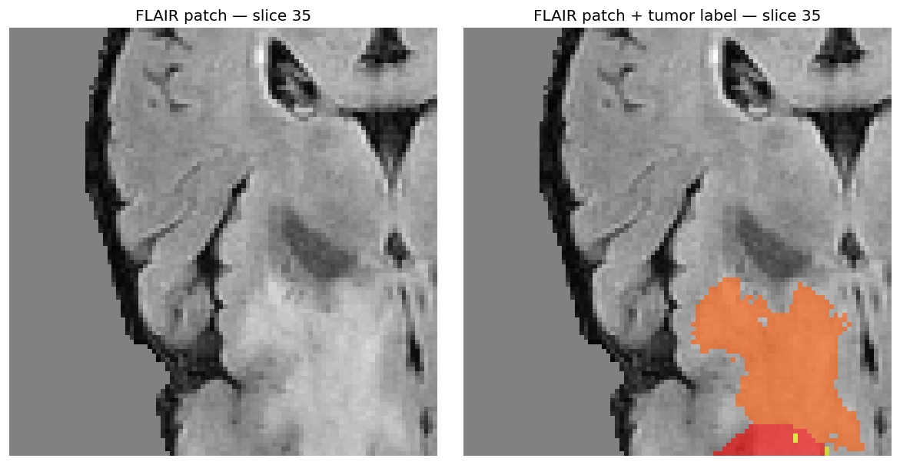
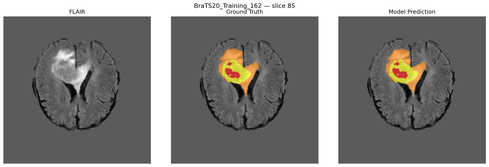
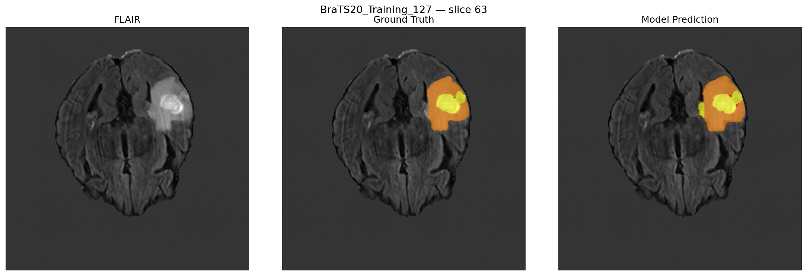
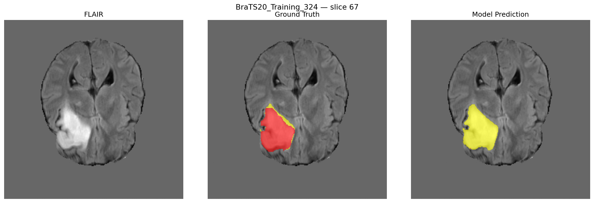
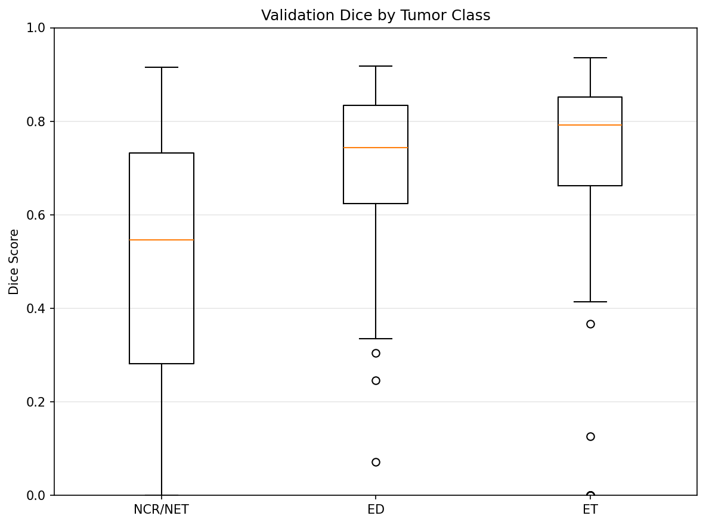
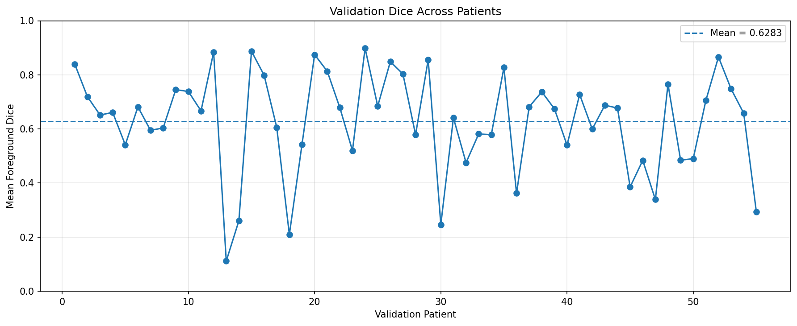

# 3D Brain Tumor Segmentation with MONAI

A baseline 3D deep-learning pipeline for multi-class brain tumor segmentation on multi-modal MRI scans from the BraTS 2020 dataset, built with MONAI and PyTorch.


---

## Overview

This project implements an end-to-end 3D medical image segmentation workflow: multi-modal MRI preprocessing, label remapping, a 3D U-Net built with MONAI, training with a combined Dice + Focal loss, sliding-window 3D inference, and quantitative and qualitative evaluation.

The model takes four co-registered MRI modalities (T1, T1ce, T2, FLAIR) as input and predicts a four-class voxel-wise segmentation (background, NCR/NET, edema, enhancing tumor). Evaluation is performed on a held-out validation split of 55 patients, with an overall validation Dice of **0.6479**.

This is a baseline research/portfolio implementation, **not** a clinical diagnostic system, and no clinical readiness or clinical usefulness is claimed.

---

## Key Results

| Metric | Result |
|---|---|
| Overall Validation Dice | **0.6479** |
| NCR/NET Dice | 0.5160 |
| ED Dice | 0.6965 |
| ET Dice | 0.7652 |
| Patient-level Mean Dice | 0.6283 ± 0.1874 |
| Validation Patients | 55 |
| Model Parameters | 4,811,129 |

---

## Training Data Preparation

An additional visualization is generated during data preparation:



This figure shows an example 3D training patch and a representative FLAIR slice with the tumor label overlaid, illustrating the foreground-biased patch sampling described in [Data Sampling](#data-sampling). It is a visualization of the training patch extraction process and ground-truth tumor labeling — **not** a model prediction.

---

## Qualitative Results

The figures below show representative axial slices of the model's predictions for a best-case, typical-case, and difficult-case patient. These are qualitative prediction visualizations — representative single-slice views — and are not a complete quantitative characterization of the full 3D segmentation volume.

<table>
  <tr>
    <th>Best Case</th>
    <th>Typical Case</th>
    <th>Difficult Case</th>
  </tr>
  <tr>
    <td></td>
    <td></td>
    <td></td>
  </tr>
  <tr>
    <td align="center">BraTS20_Training_162<br/>Mean foreground Dice: 0.8986</td>
    <td align="center">BraTS20_Training_127<br/>Mean foreground Dice: 0.6668</td>
    <td align="center">BraTS20_Training_324<br/>Mean foreground Dice: 0.1117</td>
  </tr>
</table>

---

## Quantitative Results

**Per-class Dice**



**Patient-level Dice across the validation set**



**Summary of all figures in this README**

| Visual | Purpose |
|---|---|
| `patch_samples.png` | Training data / patch sampling |
| `baseline_prediction_best_case.png` | Best-case prediction |
| `baseline_prediction_typical_case.png` | Typical-case prediction |
| `baseline_prediction_difficult_case.png` | Difficult-case prediction |
| `baseline_per_class_dice.png` | Class-wise performance |
| `baseline_patient_dice.png` | Patient-level variability |

---

## Pipeline

```
                    BraTS 2020 MRI
                         │
             ┌───────────┴───────────┐
             │                       │
        Training                  Validation
             │                       │
     T1 / T1ce / T2 / FLAIR   T1 / T1ce / T2 / FLAIR
             │                       │
      Channel-first             Channel-first
             │                       │
      Multi-modal fusion        Multi-modal fusion
             │                       │
     Nonzero channel-wise      Label remapping
        normalization                │
             │                 Nonzero channel-wise
     Foreground-biased             normalization
      random 3D crops                │
             │                 Full-volume inference
      96×96×96 patches               │
             │                       │
             └───────────┬───────────┘
                         │
                    3D U-Net
                         │
              Sliding-window inference
                         │
                 4-class prediction
                         │
              ┌──────────┴──────────┐
              │                     │
        Per-class Dice       Patient-level analysis
              │                     │
              └──────────┬──────────┘
                         │
                Qualitative results
```

No additional preprocessing steps (e.g. skull stripping, resampling, cropping, registration, or bias-field correction) are part of either pipeline described above. Random data augmentation beyond the foreground-biased patch sampling described above is not used during training.

---

## Model Architecture

A MONAI 3D U-Net:

```python
UNet(
    spatial_dims=3,
    in_channels=4,
    out_channels=4,
    channels=(16, 32, 64, 128, 256),
    strides=(2, 2, 2, 2),
    num_res_units=2,
)
```

- **Total trainable parameters:** 4,811,129
- **Input:** 4 MRI modalities (T1, T1ce, T2, FLAIR)
- **Output:** 4 segmentation classes

**Label remapping** (original BraTS label → training label → meaning):

| Original Label | Training Label | Meaning |
|---|---|---|
| 0 | 0 | Background |
| 1 | 1 | NCR/NET |
| 2 | 2 | Edema (ED) |
| 4 | 3 | Enhancing Tumor (ET) |

Training label 3 (Enhancing Tumor) does not correspond to an original BraTS label of the same value — it is created by remapping original label 4.

---

## Dataset

- **Source:** BraTS 2020 Training Dataset
- **Development dataset size:** 369 patients (at the point the split was created)

The data preparation pipeline identified the available patient folders and created a **patient-level split** using a fixed random seed of **42**:

| Subset | Proportion |
|---|---|
| Train | 70% |
| Validation | 15% |
| Test | 15% |

The split is performed at the patient level so that scans from the same patient cannot appear in more than one subset. The resulting split is saved to [`configs/dataset_split.json`](configs/dataset_split.json).

The final evaluation reported in this project was performed on the **55-patient validation split**. The test split was not used to produce any of the results reported here, and no test-set performance is reported in this README.

---

## Preprocessing

Preprocessing differs between training and validation/inference.

### Training Preprocessing

For each patient, the pipeline:

1. Loads the T1, T1ce, T2, and FLAIR MRI volumes.
2. Loads the segmentation label.
3. Converts the data to channel-first format.
4. Concatenates the four MRI modalities into a four-channel image.
5. Applies nonzero, channel-wise intensity normalization.
6. Extracts 3D training patches using foreground-biased random sampling.

**Training patch configuration**

| Setting | Value |
|---|---|
| Patch size | (96, 96, 96) |
| Sampling transform | `RandCropByPosNegLabeld` |
| Positive sampling weight | 1 |
| Negative sampling weight | 1 |
| Patches sampled per patient volume | 2 |

This foreground-aware sampling strategy increases the likelihood that training patches contain tumor tissue, helping address the strong class/volume imbalance inherent in brain tumor segmentation.

### Validation / Inference Preprocessing

Validation data uses **deterministic** preprocessing rather than random patch sampling. The validation pipeline:

1. Loads the four MRI modalities and segmentation label.
2. Ensures channel-first format.
3. Remaps the BraTS labels (0→0, 1→1, 2→2, 4→3).
4. Concatenates T1, T1ce, T2, and FLAIR into a four-channel input.
5. Applies nonzero, channel-wise intensity normalization.

During inference, complete 3D volumes are processed using MONAI sliding-window inference with a patch size of (96, 96, 96) and `sw_batch_size = 1`. Random patch sampling and data augmentation are used only in the training pipeline and are **not** applied during validation or inference.

---

## Data Sampling

Brain tumor regions occupy a relatively small portion of a typical MRI volume, creating a substantial foreground/background imbalance. To make training patches more informative, the training pipeline uses MONAI's `RandCropByPosNegLabeld` transform.

The configuration samples 1 positive patch and 1 negative patch — 2 patches per patient volume per training iteration — with a patch size of (96, 96, 96). This provides a mixture of tumor-containing and background-focused patches rather than relying entirely on uniformly random 3D crops.

The validation pipeline does not use this random sampling strategy; validation is instead performed on complete volumes using sliding-window inference.

---

## Training

| Setting | Value |
|---|---|
| Model | 3D MONAI U-Net |
| Epochs | 15 |
| Optimizer | Adam |
| Learning rate | 2e-4 |
| Loss | DiceFocalLoss |
| Input modalities | T1, T1ce, T2, FLAIR |
| Output classes | 4 |
| Checkpoint selection | Best validation Dice |

**Training loss progression**

| Epoch | Loss |
|---|---|
| 1 | 0.4886 |
| 2 | 0.3824 |
| 3 | 0.3110 |
| 4 | 0.2664 |
| 5 | 0.2330 |
| 6 | 0.2117 |
| 7 | 0.1975 |
| 8 | 0.1867 |
| 9 | 0.1797 |
| 10 | 0.1789 |
| 11 | 0.1709 |
| 12 | 0.1704 |
| 13 | 0.1683 |
| 14 | 0.1604 |
| 15 | 0.1526 |

**Validation Dice (computed periodically during training)**

| Epoch | Validation Dice |
|---|---|
| 3 | 0.4640 |
| 6 | 0.5749 |
| 9 | 0.6281 |
| 12 | 0.5887 |
| 15 | 0.6479 |

**Best validation Dice: 0.6479 (epoch 15)**

Experiment tracking was performed with Weights & Biases:

- **Project:** `brain-tumor-segmentation`
- **Run:** `baseline-3dunet-lossfix-final`
- **Run ID:** `zk2o3wxp`

---

## Inference

Inference uses MONAI's sliding-window inference:

- **Patch size:** (96, 96, 96)
- **Sliding-window batch size:** 1
- **Validation set:** 55 patients

Evaluation was independently performed using the saved best checkpoint and reproduced the training-time overall validation Dice exactly.

---

## Evaluation

**Metric configuration**

```python
DiceMetric(
    include_background=False,
    reduction="mean"
)
```

Predictions are converted to class labels via argmax and then one-hot encoded for metric computation. Ground-truth labels are also converted to a one-hot representation. The background class is excluded from the metric. Only Dice is reported in this baseline — IoU, Hausdorff distance, sensitivity, specificity, precision, and recall were not evaluated.

**Overall validation Dice: 0.6479** (primary headline metric)

**Per-class Dice**

| Class | Dice |
|---|---|
| NCR/NET | 0.5160 |
| ED | 0.6965 |
| ET | 0.7652 |

**Patient-level evaluation** (55 validation patients)

- Mean foreground Dice: **0.6283 ± 0.1874**
- Median foreground Dice: **0.6668**

| Case | Patient ID | Mean Foreground Dice |
|---|---|---|
| Best-performing | BraTS20_Training_162 | 0.8986 |
| Typical / median-like | BraTS20_Training_127 | 0.6668 |
| Most difficult | BraTS20_Training_324 | 0.1117 |

Individual patient IDs above illustrate the spread of performance and should not be overinterpreted as representative of any broader pattern.

**Note on the two headline Dice numbers:** 0.6479 is the overall validation Dice computed using the same MONAI `DiceMetric` configuration used during training — i.e., a single aggregate Dice computed across all validation voxels/cases together. 0.6283 ± 0.1874 is the mean and standard deviation of *per-patient* mean foreground Dice values, averaged after computing a separate score for each patient. These use different aggregation procedures, so they are not expected to match and are not contradictory.

---

## Result Interpretation

- An overall validation Dice of 0.6479 indicates the baseline model learned meaningful tumor-region segmentation.
- Enhancing Tumor (ET) achieved the highest class Dice at 0.7652.
- Edema (ED) achieved 0.6965.
- NCR/NET was the most difficult class at 0.5160.
- Patient-level performance varies substantially, with a mean foreground Dice standard deviation of 0.1874.
- The difficult-case example (BraTS20_Training_324, 0.1117) illustrates that strong aggregate performance does not imply uniformly strong performance across every individual patient.

No claim of state-of-the-art performance is made, and no comparison against published methods is included.

---

## Computational Details

- **Evaluation hardware:** NVIDIA Tesla T4
- **Full 55-patient inference time:** approximately 7.9 minutes (approximate runtime, not a guaranteed benchmark)

---

## Repository Structure

```
.
├── README.md
├── notebooks/
│   ├── baseline_training_complete.ipynb
│   └── evaluation.ipynb
│   └── data_exploration.ipynb
│   └── data_preparation.ipynb
├── configs/
│   └── dataset_split.json
├── models/
│   └── baseline/
│       └── best_model.pth
├── results/
│   ├── figures/
│   │   ├── patch_samples.png
│   │   ├── baseline_prediction_best_case.png
│   │   ├── baseline_prediction_typical_case.png
│   │   ├── baseline_prediction_difficult_case.png
│   │   ├── baseline_patient_dice.png
│   │   └── baseline_per_class_dice.png
│   └── metrics/
│       ├── baseline_validation_metrics.csv
│       ├── baseline_patient_dice.csv
│       └── baseline_evaluation_summary.csv
└── archive/
    └── [BraTS dataset files - not included in GitHub]
```

This describes the intended repository organization. The BraTS dataset itself is not included in the repository, and large model artifacts or the full raw dataset are not appropriate to commit to GitHub directly.

### Notebooks

- **`notebooks/baseline_training_complete.ipynb`** — the baseline model training pipeline.
- **`notebooks/evaluation.ipynb`** — a standalone evaluation notebook that does not depend on variables remaining in memory from the training notebook. It independently reconstructs the validation pipeline, loads the saved checkpoint, runs inference on the 55 validation patients, and reproduces the overall validation Dice of 0.6479. This independence is a deliberate reproducibility strength of the project.

### Results files

- **`results/metrics/baseline_validation_metrics.csv`** — overall/aggregate validation metrics produced during evaluation.
- **`results/metrics/baseline_patient_dice.csv`** — per-patient Dice scores across the 55 validation patients.
- **`results/metrics/baseline_evaluation_summary.csv`** — a summary of evaluation results (e.g., per-class and aggregate statistics).

---

## Reproducibility

- The full training configuration (architecture, optimizer, learning rate, loss, epochs) is documented above.
- The patient-level 70/15/15 train/validation/test split was generated with a fixed random seed of 42 and is stored in `configs/data_split.json`, so it can be regenerated or verified exactly.
- The exact model architecture is specified in the [Model Architecture](#model-architecture) section.
- `evaluation.ipynb` independently reconstructs the validation pipeline rather than relying on in-memory state from training.
- The best checkpoint is saved under `models/baseline/best_model.pth`.
- Evaluation results are saved under `results/metrics/`.
- Visual results are saved under `results/figures/`.

---

## Limitations

1. Evaluation is performed on a held-out validation split rather than an independent external test cohort.
2. Performance varies considerably across patients.
3. NCR/NET is the weakest-performing class in this baseline.
4. The model uses a relatively straightforward 3D U-Net architecture.
5. The current baseline does not include extensive augmentation or architectural experimentation.
6. Only Dice is reported as the primary segmentation metric.
7. Qualitative figures are representative visualizations and should not be interpreted as a complete quantitative characterization of the 3D segmentation.
8. This is a research/portfolio implementation and is not a clinical diagnostic tool.

---

## Future Work

The following are potential directions for future work and have not been implemented in this baseline:

- Stronger 3D architectures
- Improved loss functions
- Test-time augmentation
- Post-processing
- Uncertainty estimation
- External test-set evaluation
- Ablation studies
- Extended experiment tracking and comparison through W&B

---

## Dataset Acknowledgement

> Dataset: BraTS 2020. https://www.kaggle.com/datasets/awsaf49/brats2020-training-data

---

## Why This Project

3D brain tumor segmentation is a challenging medical-imaging task because tumors vary substantially in size, location, appearance, and tissue characteristics. Multi-modal MRI provides complementary information across the T1, T1ce, T2, and FLAIR sequences.

This project demonstrates how a 3D segmentation model can integrate multiple MRI modalities and produce voxel-level, multi-class predictions. It is framed as an engineering/research portfolio project focused on:

- 3D deep learning
- Medical image segmentation
- Multi-modal data integration
- MONAI / PyTorch
- Reproducible evaluation
- Quantitative and qualitative analysis

